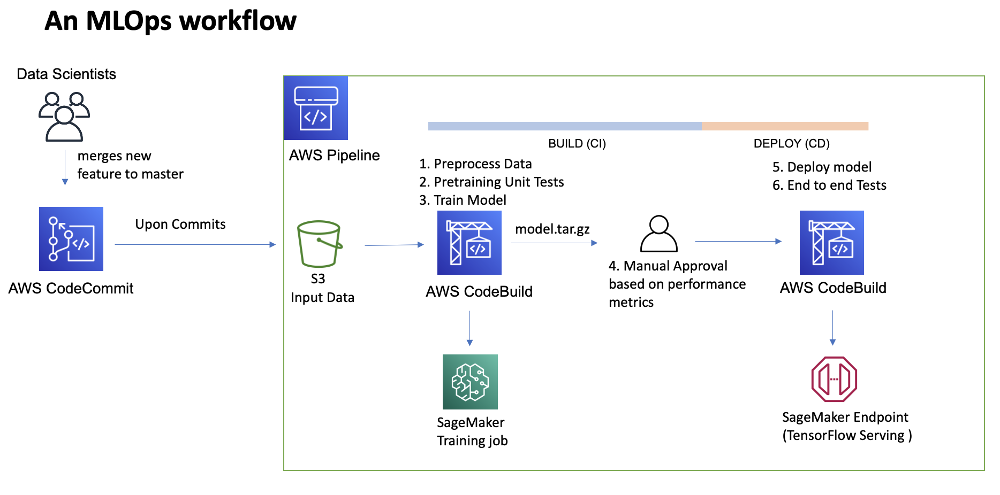

## Introduction: 
As the AI/ML industry is rapidly evolving from academia and scientific journals to production
systems, there is a need to apply modern software engineering best practices to ML systems while respecting the unique
properties of an ML system. This repo is useful if you want to learn about an end to end implementation of MLOps pipeline on AWS cloud.   

## Description: 
The repo builds and deploys a MLOps Pipeline on AWS Cloud. It involves 
a machine learning workflow as applied to a NLP usecase. A tensorflow LSTM based classifer is trained on comments Wikipedia to identify toxic and hate comments. The pipeline involves the below stages - 
 - Preprocessing
 - Pre Training Tests
 - Model Training
 - Manual Approval
 - Deploy to an endpoint
 - Post training tests
 

## Features:
#### ML
- Builds TensorFlow (NLP) model using SageMaker script mode
- Reuse preprocessing between train and inference stages
#### Ops
- Orchestration made simpler using AWS Code Suite
- Unit & Functional tests incorporated along with human in the loop approach
- Built with Infrastructure as code; Can be Reused with custom train and preprocess scripts for other use cases

## Prerequisites: 
 - AWS CLI version 2
 - Python 3.7 
 - Ensure you have permission to create IAM roles and create resources
 - Activate virtual environment using `python3 -m venv .venv; source .venv/bin/activate`
 - Install package dependencies using `pip install -r requirements.txt`
 - If you do not have access to a GPU, change the instance type in .env
 
## Dataset: 
 - Create a kaggle account, download the API key and ensure its present in ~/.kaggle/kaggle.json, or export the token. more details- https://github.com/Kaggle/kaggle-api#competitions
 - Change configuration parameters as required in .env file in the root. 
 - Run `bash ./scripts/download_data.sh`. The script downloads the data, creates an s3 bucket and uploads the data. 
 
## Run: 
 - Deploy the infrastructure. Run the bash script- 
   `bash ./scripts/deploy_infrastructure.sh`
 - A code commit repo is created and the pipeline is trigerred by the default first commmit. After the stack is created succesfully, navigate to CodePipeline and monitor the run.    
 - Once the pipeline run is completed, verify an endpoint is deployed in Sagemaker. 

 ## Cleanup:
 - Run the bash script to tear down all the infrastructure. Please note this will delete the S3 bucket as well. If you are using an existing bucket that you do not want to delete, comment line 14. 
    `bash ./scripts/cleanup.sh`

## Limitations & Future Considerations:
 - In cases of complex orchestration of training activities for multiple if-else conditions, consider using AWS Step Functions 
 - In cases of longer duration of training jobs, consider trigerring the training jobs asynchronously from AWS CodeBuild to save cost. 

